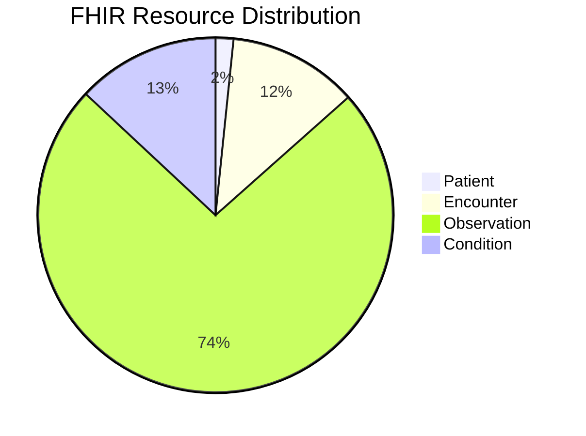
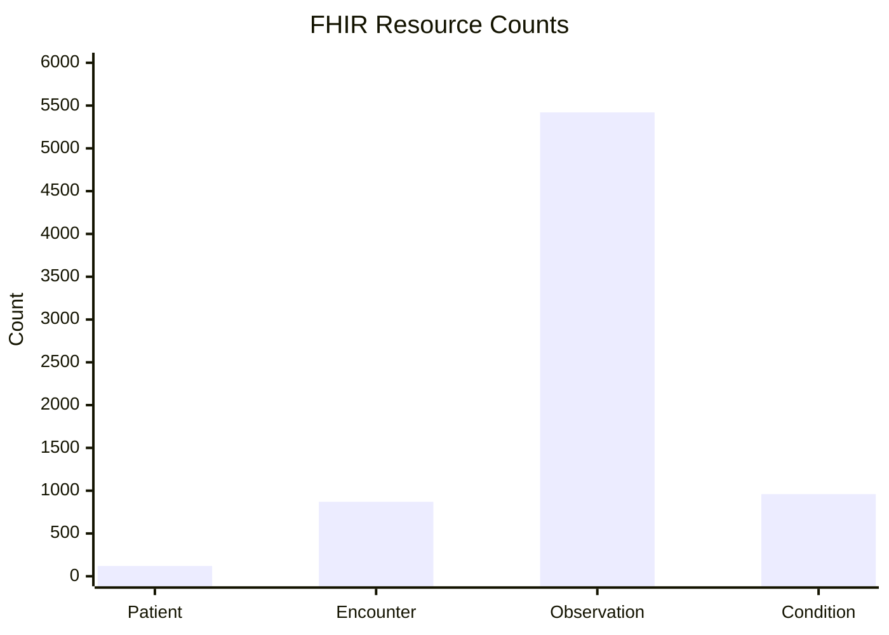

# Gemini + VS Code + HL7 FHIR MCP

Tài liệu này thiết lập cấu hình hoàn chỉnh để Gemini và VS Code gọi MCP server `hl7-fhir-local` trong workspace này, đồng thời đưa ra mẫu prompt cho:

- truy vấn tổng hợp
- báo cáo phân tích
- biểu đồ trực quan

## 1. Cấu hình đã có trong repo

Gemini workspace config:

- [`.gemini/settings.json`](/home/suno/Downloads/HL7/.gemini/settings.json)

VS Code workspace MCP config:

- [`.vscode/mcp.json`](/home/suno/Downloads/HL7/.vscode/mcp.json)

Config hiện tại dùng:

- FHIR base URL: `http://localhost:8081/fhir`
- MCP transport cho editor: `stdio`
- auth: tắt, phù hợp local HAPI FHIR

## 2. Điều kiện chạy

### Khởi động HAPI FHIR

```bash
cd /home/suno/Downloads/HL7/HL7_FHIR
docker compose up -d
curl -s http://localhost:8081/fhir/metadata
```

### Điều kiện cho MCP server

Các config hiện tại chạy server bằng Python trong virtualenv của workspace:

```bash
/home/suno/Downloads/HL7/venv/bin/python -m fhir_mcp_server --transport stdio
```

Biến môi trường được truyền tự động:

- `PYTHONPATH=/home/suno/Downloads/HL7/fhir-mcp-server/src`
- `FHIR_SERVER_BASE_URL=http://localhost:8081/fhir`
- `FHIR_SERVER_DISABLE_AUTHORIZATION=True`

## 3. Dùng với Gemini CLI

Script launcher đã có:

- [`scripts/gemini_hl7.sh`](/home/suno/Downloads/HL7/scripts/gemini_hl7.sh)

Chạy:

```bash
cd /home/suno/Downloads/HL7
bash scripts/gemini_hl7.sh
```

Script này:

- kiểm tra `gemini` CLI có trong `PATH`
- kiểm tra HAPI FHIR đang sống qua `/metadata`
- mở Gemini ngay trong workspace có cấu hình MCP

Nếu Gemini đọc `.gemini/settings.json` đúng, model sẽ thấy server `hl7-fhir-local` và có thể gọi tool FHIR qua MCP.

## 4. Dùng với VS Code

Workspace này đã có file:

- [`.vscode/mcp.json`](/home/suno/Downloads/HL7/.vscode/mcp.json)

Nếu extension/client MCP của VS Code đang bật cho workspace, chỉ cần mở thư mục:

```bash
code /home/suno/Downloads/HL7
```

Sau đó kiểm tra trong UI MCP của VS Code xem server `hl7-fhir-local` có trạng thái `Connected` hay không.

Nếu VS Code của bạn không tự nhận `.vscode/mcp.json`, dùng cùng nội dung đó để nhập thủ công ở phần:

- `MCP: Open User Configuration`
- hoặc màn hình `Connect to a custom MCP`

### STDIO config cho VS Code

```json
{
  "servers": {
    "hl7-fhir-local": {
      "command": "/home/suno/Downloads/HL7/venv/bin/python",
      "args": [
        "-m",
        "fhir_mcp_server",
        "--transport",
        "stdio"
      ],
      "env": {
        "PYTHONPATH": "/home/suno/Downloads/HL7/fhir-mcp-server/src",
        "FHIR_SERVER_BASE_URL": "http://localhost:8081/fhir",
        "FHIR_SERVER_DISABLE_AUTHORIZATION": "True"
      }
    }
  }
}
```

## 5. Tuỳ chọn mạnh hơn: Streamable HTTP

Nếu muốn Postman, browser, hoặc client ngoài editor gọi chung một MCP endpoint, chạy server dạng HTTP:

```bash
cd /home/suno/Downloads/HL7
FHIR_SERVER_BASE_URL=http://localhost:8081/fhir \
FHIR_SERVER_DISABLE_AUTHORIZATION=True \
PYTHONPATH=/home/suno/Downloads/HL7/fhir-mcp-server/src \
/home/suno/Downloads/HL7/venv/bin/python -m fhir_mcp_server --transport streamable-http --log-level INFO
```

Endpoint:

- `http://127.0.0.1:8000/mcp/`

Config VS Code dạng HTTP:

```json
{
  "servers": {
    "hl7-fhir-local": {
      "type": "http",
      "url": "http://127.0.0.1:8000/mcp/"
    }
  }
}
```

Khi dùng trong editor, `stdio` thường gọn hơn. Khi cần test liên client, `streamable-http` tiện hơn.

## 6. Cách yêu cầu cho bài toán tổng hợp và báo cáo

Nên ép model làm việc theo 2 bước:

1. dùng MCP để lấy dữ liệu FHIR có cấu trúc
2. tổng hợp kết quả thành bảng, nhận xét, và biểu đồ

### Prompt mẫu 1: báo cáo tổng quan

```text
Hãy dùng MCP server `hl7-fhir-local` để tạo báo cáo tổng quan dữ liệu FHIR local.

Yêu cầu:
- kiểm tra khả năng của các resource: Patient, Encounter, Observation, Condition
- đếm tổng số bản ghi cho từng resource
- nêu 10 mã/term Observation xuất hiện nhiều nhất nếu truy vấn được
- trả kết quả theo dạng:
  1. tóm tắt điều hành ngắn
  2. bảng số liệu
  3. nhận xét dữ liệu bất thường
  4. đề xuất bước kiểm tra tiếp theo

Luôn ưu tiên gọi tool MCP trước khi kết luận.
```

### Prompt mẫu 2: báo cáo theo bệnh nhân

```text
Hãy dùng MCP `hl7-fhir-local` để phân tích 20 bệnh nhân gần đây nhất.

Yêu cầu:
- lấy Patient
- nối các Encounter và Condition liên quan nếu có thể
- tóm tắt nhóm tuổi, giới tính, số lần khám
- trả về báo cáo Markdown có bảng
- nếu dữ liệu thiếu, ghi rõ thiếu ở trường nào
```

### Prompt mẫu 3: biểu đồ Mermaid

```text
Hãy dùng MCP `hl7-fhir-local` để lập báo cáo số lượng resource gồm Patient, Encounter, Observation, Condition.

Sau khi lấy số liệu:
- tạo bảng Markdown
- tạo thêm 1 biểu đồ Mermaid dạng pie
- tạo thêm 1 biểu đồ Mermaid dạng xychart-beta hoặc bar nếu phù hợp
- viết 3 nhận xét ngắn từ số liệu

Chỉ dùng số liệu lấy từ MCP, không tự bịa.
```

## 7. Mẫu đầu ra biểu đồ

Gemini hoặc VS Code chat có thể trả ra Mermaid trực tiếp. Ví dụ:



Hoặc:



Nếu UI chat không render Mermaid, vẫn có thể yêu cầu model trả:

- bảng Markdown
- JSON summary
- CSV mini

để bạn đưa sang Excel, Grafana, Superset, hoặc notebook.

## 8. Cách viết prompt để kết quả mạnh hơn

Nên yêu cầu rõ:

- resource cần dùng
- phạm vi thời gian
- số lượng mẫu
- định dạng đầu ra
- yêu cầu không suy đoán ngoài dữ liệu MCP

Prompt tốt:

```text
Dùng MCP `hl7-fhir-local`. Trước khi truy vấn hãy gọi tool capability tương ứng.
Mục tiêu: tạo báo cáo thống kê Condition theo patient gender.
Đầu ra gồm:
1. executive summary 5 dòng
2. bảng thống kê
3. Mermaid bar chart
4. các hạn chế dữ liệu
Không tự suy diễn nếu MCP không trả đủ dữ liệu.
```

## 9. Khi nào nên dùng MCP, khi nào nên dùng script

Dùng MCP khi:

- hỏi đáp dữ liệu FHIR
- phân tích
- đếm, lọc, tra cứu resource
- tạo báo cáo từ dữ liệu server đang chạy

Dùng script riêng khi:

- bulk import hàng trăm file bundle
- ETL nặng
- pipeline định kỳ
- xuất dữ liệu lớn để vẽ chart ngoài hệ thống chat

Trong repo này:

- MCP phù hợp cho truy vấn và báo cáo
- [`scripts/main.py`](/home/suno/Downloads/HL7/scripts/main.py) vẫn phù hợp hơn cho upload/import

## 10. Quy trình khuyến nghị

1. Chạy HAPI FHIR.
2. Mở Gemini bằng `bash scripts/gemini_hl7.sh` hoặc mở workspace trong VS Code.
3. Xác nhận MCP server `hl7-fhir-local` đã kết nối.
4. Dùng prompt có yêu cầu rõ về bảng + nhận xét + Mermaid.
5. Nếu cần dashboard thật, xuất summary rồi đưa sang công cụ trực quan chuyên dụng.
